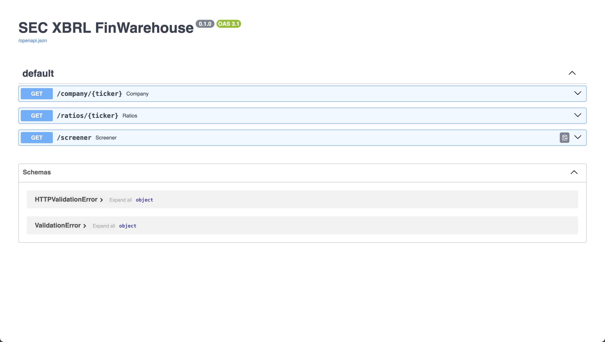

# sec-xbrl-finwarehouse

Mini financial data-warehouse built from **SEC XBRL “company facts”**.

Pipeline (V1):
1) Fetch SEC data (ticker → CIK, company facts JSON)
2) Load into **PostgreSQL** (`companies`, `filings`, `facts`)
3) Build normalized **annual statements** (`statements_annual`)
4) Compute **annual ratios** (`ratios_annual`)
5) Expose a small **FastAPI** layer (company lookup, ratios, screener)

This project is intentionally small but end-to-end: ingestion → storage → transformation → analytics → API.

---

## Tech stack

- Python 3
- PostgreSQL (local via Homebrew)
- `requests`, `python-dotenv`, `psycopg2-binary`
- FastAPI + Uvicorn

---

## Data source

SEC public endpoints:
- Ticker/CIK mapping: `https://www.sec.gov/files/company_tickers.json`
- Company facts (XBRL): `https://data.sec.gov/api/xbrl/companyfacts/CIK##########.json`

**Note:** SEC requires a real `User-Agent` identifying the requester.

---

## Quickstart

### 1) Create and activate a virtualenv

python3 -m venv .venv
source .venv/bin/activate
pip install -r requirements.txt

### 2) Install & start PostgreSQL (Homebrew)

brew install postgresql@16
brew services start postgresql@16

If `psql` is not found, add Postgres to your PATH (current terminal):

export PATH="$(brew --prefix postgresql@16)/bin:$PATH"

### 3) Create the database and tables

createdb secwarehouse
psql -d secwarehouse -f db/schema.sql

### 4) Create your `.env`

At repo root, create a file named `.env`:

SEC_USER_AGENT=Your Name your.email@domain.com
DATABASE_URL=postgresql://YOUR_MAC_USERNAME@localhost:5432/secwarehouse
TICKERS=AAPL,MSFT,GOOGL,AMZN,NVDA,JPM,KO,UNH,XOM,CAT

* `DATABASE_URL`: for local Homebrew Postgres it’s usually your Mac username and no password.
* `.env` is ignored by git (see `.gitignore`).

### 5) Run the pipeline (V1)

Seed companies (ticker → CIK):
python scripts/seed_companies.py

Ingest core facts + filings (SEC → Postgres):
python scripts/ingest_facts.py

Build annual statements:
python scripts/build_statements_annual_v3.py

Compute annual ratios:
python scripts/compute_ratios.py

### 6) Start the API

bash
uvicorn sec_xbrl_finwarehouse.api:app --reload

Open:

* Swagger UI: `http://127.0.0.1:8000/docs`

---

## API endpoints

### `GET /company/{ticker}`

Returns basic company metadata.

Example:

* `/company/AAPL`

### `GET /ratios/{ticker}?limit=10`

Returns annual ratios for a ticker (latest first).

Example:

* `/ratios/AAPL?limit=5`

### `GET /screener?year=2024&min_roe=0.3&min_fcf_margin=0.1`

Simple screener over `ratios_annual`.

Example:

* `/screener?year=2024&min_roe=0.3&min_fcf_margin=0.1&limit=25`

---

## Notes / design choices

* **Relational integrity:** `facts` references `filings` (FK) to keep provenance.
* **Revenue tags vary by issuer:** ingestion includes multiple revenue candidates:
  `RevenueFromContractWithCustomerExcludingAssessedTax`, `SalesRevenueNet`, `Revenues`.
* **Annual filtering (V3):**

  * “Flow” metrics (revenues, net income, cash flow) are filtered to ~1-year periods (330–380 days) and `10-K/20-F`.
  * “Stock” metrics (assets, liabilities, equity) are treated as point-in-time at FY end.
* **ROE can exceed 100%** for some companies when equity is small (e.g., heavy buybacks).

---

## Project structure

text
db/
  schema.sql
scripts/
  seed_companies.py
  ingest_facts.py
  build_statements_annual_v3.py
  compute_ratios.py
src/sec_xbrl_finwarehouse/
  sec_client.py
  db.py
  api.py

---

## Next ideas

* Add data quality checks (missingness, outliers, duplicate accession handling)
* Store a broader statement schema and calculate more ratios (ROIC, debt ratios, growth rates)
* Streamlit dashboard consuming the API
* Caching + retries + stricter SEC fair-access throttling